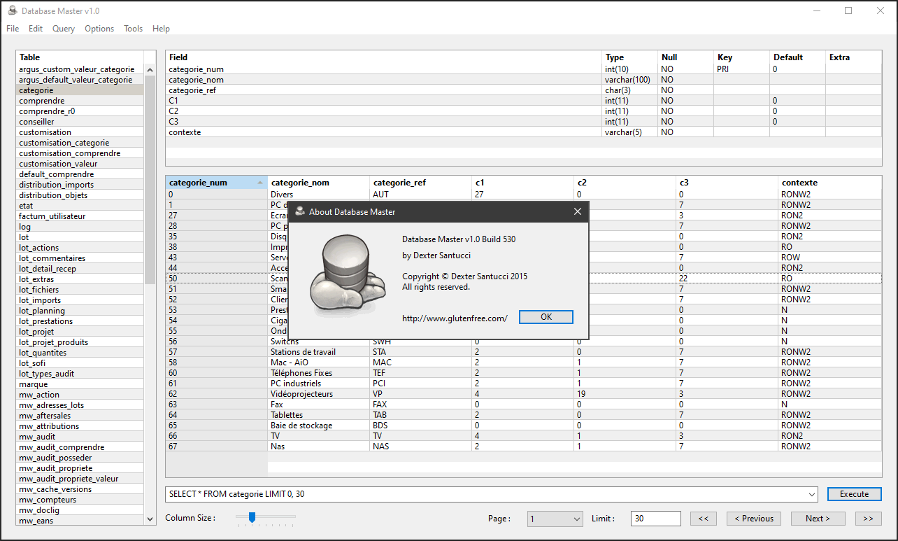
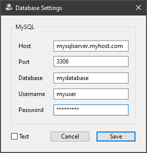
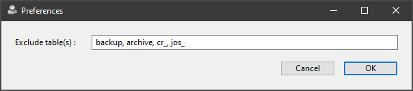
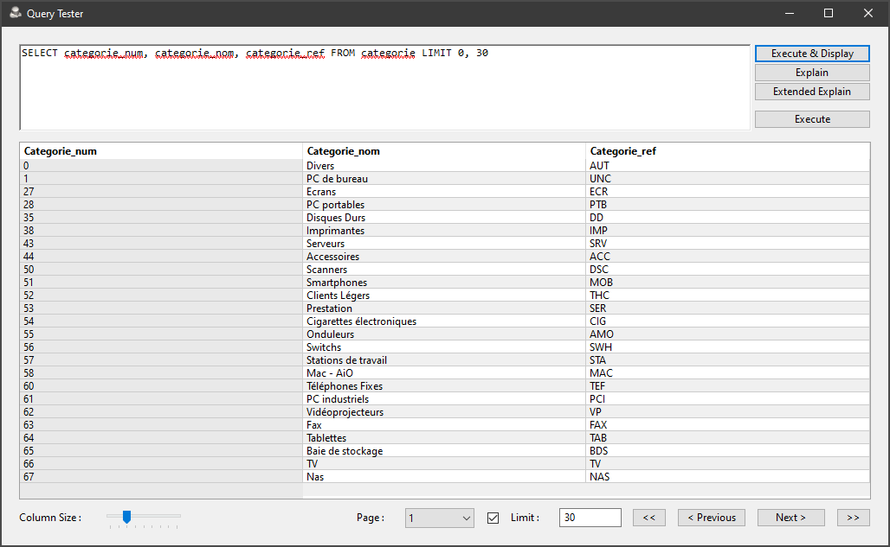
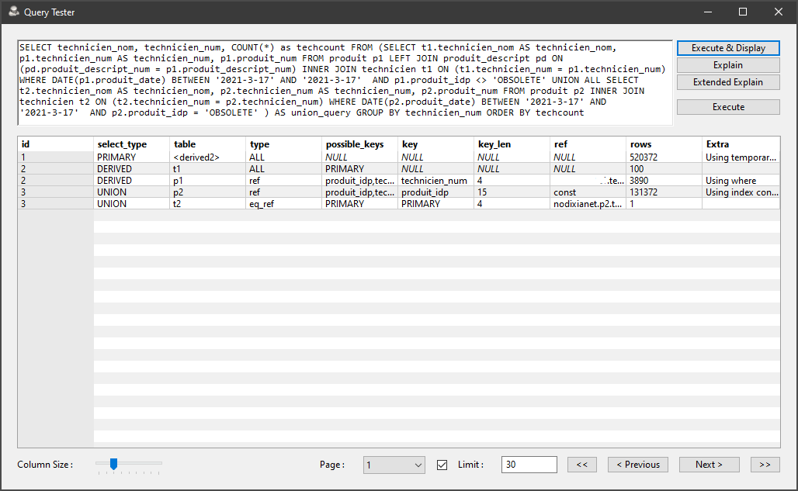
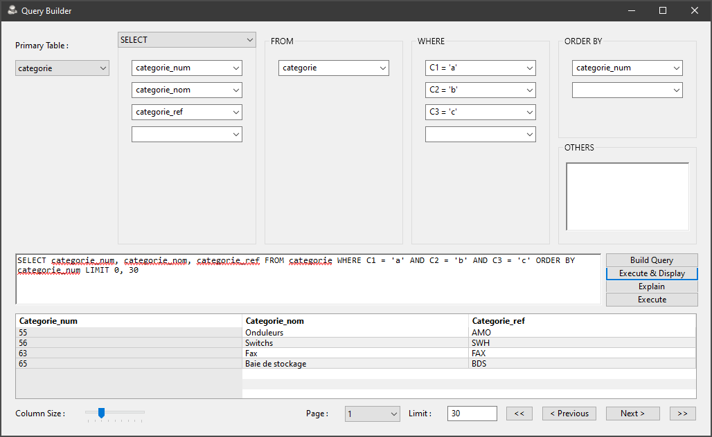
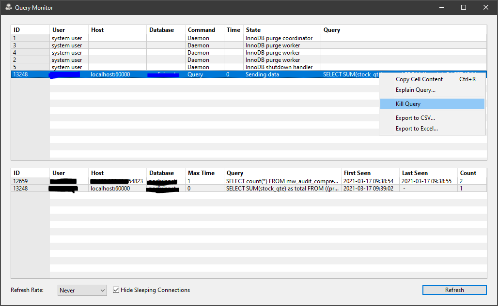

# Database Master
A small, simple tool to manage a MySQL database. Includes a decent query monitor with real-time explain and kill.

Here is the configuration dialog, where you input your database settings :

One can specify which table prefixes to ignore, to hide them from the left-hand table list :

This is the Query Tester window, that let you input queries and execute them. The results are displayed as table below :

The same window sports 'Explain' and 'Explain Advanced' buttons, which displays information about a query. Useful to troubleshoot and tune query performance :

Here is the Query Building window, used to generate queries visually :

FInally, the Query Monitor is an advanced tool which displays queries being executed on the server in real-time. The delay between list refreshes can be adjusted from 'Never' to 30 seconds. There are several fonctions available via context menus, such as 'Explain', which opens the selected query in the Query Tester window, and explains it, or 'Kill', which cancels the query thread - useful to kill queries taking too long.

Cheers,

Dexter
