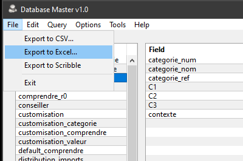

# Database Master

A small, simple tool to manage a MySQL database. Includes a decent query monitor with real-time explain and kill.
This is the <b>Main Window</b> of the app :

# Downloads

You can <b>download</b> the latest release for <b>Windows</b> and <b>Linux</b> [HERE](https://github.com/DexterLagan/database-master/releases).

# Features

Several practical functions are hidden in the main menu, replicated in contextual menus available in each list-box. '<b>Export to CSV</b>' and '<b>Export to Excel</b>' are self-explanatory. '<b>Export to Scribble</b>' is a more advanced feature which exports to Racket's Scribble documentation format. Scribble is a domain-specific language used to create application and language manuals. It outputs HTML and PDF through Latex.

Here is the <b>Configuration Dialog</b>, where you input your database settings :

On the <b>Preferences Dialog</b>, one can specify which table prefixes to ignore to hide them from the left-hand table list :

This is the <b>Query Tester</b> window, that let you input queries and execute them. The results are displayed as table below :

The same window sports 'Explain' and 'Extended Explain' buttons, which displays information about a query. Useful to troubleshoot and tune query performance :

Here is the <b>Query Builder</b> window, used to generate queries visually :

Finally, the <b>Query Monitor</b> is an advanced tool which displays queries being executed on the server in real-time. The delay between list refreshes can be adjusted from 'Never' to 30 seconds. There are several fonctions available via context menus, such as 'Explain', which opens the selected query in the Query Tester window, and explains it, or 'Kill', which cancels the query thread - useful to kill queries taking too long.

# Other Features

- contextual export function to Excel and CSV;
- automatic, context-aware column size adjustment (i.e. comment columns are larger);
- fast, efficient binaries with small memory footprint;
- query monitor long query log with executation time and 'explain' function;
- optionnal side-panel list-view on the Main Window activated on double-click.

## Version History
- v1.0 build 536
  - added support for deleting servers in the configuration dialog.
- v1.0 build 534
  - added new installer based on InnoSetup v6.x;
  - added full support for loading/saving an unlimited number of MySQL servers;
  - removed obsolete 'test' database server switch;
  - added official support for Dark Mode;
  - added support for Hi-DPi;
  - switched to Windows 64 bits as default platform.
- v1.0 build 533
  - preferences dialog is now known as 'Display Exclusions', updated main menu bar;
  - refactored window centering code and made it part of a common module.
- v1.0 build 532
  - improved query monitor;
  - started work on support for multiple databases.
- v1.0 build 531
  - added support for hiding ghost processes in Query Monitor.
- v1.0 build 530
  - added support for automatic refresh to the Query Monitor.

## License

Database Master is free software; see [LICENSE](https://github.com/DexterLagan/database-master/blob/main/LICENSE) for more details.
